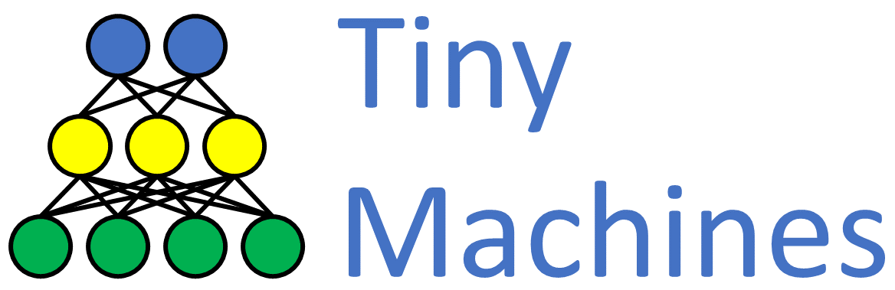

# TinyMachines.jl

[](https://github.com/cirobr/TinyMachines.jl/actions/workflows/CI.yml?query=branch%3Amain)

A collection of tiny machine learning models for semantic image segmentation in IoT devices, written in Julia/Flux.

Besides regular mask outputs, all models deliver their internal feature maps as additional outputs, which are useful for model compression through knowledge distillation.


## UNet5, UNet4

UNet5 is the classic U-Net architecture, with five encoder/decoder levels. UNet4 has four levels.

Reference:
* "U-Net: Convolutional Networks for Biomedical Image Segmentation" ([arXiv](https://arxiv.org/abs/1505.04597)). Credits: Ronnenberger, Olaf; Fischer, Philipp; and Brox, Thomas.


## MobileUNet

Mobile-Unet has the same encoder structure as the Mobilenet-V2 classification model, and the same u-shape and skip connection principles as the U-Net.

Reference:
* "Mobile-Unet: An efficient convolutional neural network for fabric defect detection" ([doi.org](https://doi.org/10.1177/0040517520928604)). Credits: Jing, Junfeng; Wang, Zhen; Ratsch, Matthias; and Zhang, Huanhuan.


## ESPNet
ESPNet utilizes the Efficient Spatial Pyramid module and the PReLU nonlinearity.

Reference:
* Efficient Spatial Pyramid of Dilated Convolutions for Semantic Segmentation" ([arXiv](https://arxiv.org/abs/1803.06815)). Credits: Mehta, Sachin; Rastegari, Mohammad; Caspi, Anat; Shapiro, Linda; and Hajishirzi, Hannaneh.


## PReLU
PReLU is a trainable nonlinearity, which is incorporated in ESPNet.

Reference:
* "Delving Deep into Rectifiers: Surpassing Human-Level Performance on ImageNet Classification" ([arXiv](https://arxiv.org/abs/1502.01852)). Credits: Kaiming He, Xiangyu Zhang, Shaoqing Ren, Jian Sun.


## Credits
Credits for the original architectures go to the references' authors, as aforementioned.

Credits for the implementations in Julia/Flux go to Ciro B Rosa.
* GitHub: https://github.com/cirobr
* LinkedIn: https://www.linkedin.com/in/cirobrosa/


## Syntax

With no arguments, all models accept 3-channels Float32 input and deliver 1-channel mask with sigmoid output activation.

```
model = UNet5()      # sigmoid output
model = UNet4(3,1)   # sigmoid output
```

If ch_out > 1, output activation becomes softmax. For instance, a model with 3-channels input and 2-channels output becomes:

```
model = UNet5(3,2)   # softmax output
```


## Models

```
UNet5(3, 1;              # input/output channels
    activation = relu,   # activation function
)
```

```
UNet4(3, 1;              # input/output channels
    activation = relu,   # activation function
)
```

```
MobileUNet(3, 1;        # input/output channels
    activation=relu6,   # activation function
)
```

```
# Model calls for alpha2=5, alpha3=8, which differ from default constructor
# ConvPReLU is incorporated, no need to pass activation function
ESPNet(3, 1;             # input/output channels
    activation="prelu"   # activation function (if "prelu", use between quotes) 
)
```


## Constructors

Constructors are models which allow access to a multitude of hyperparameters. Each model from above has been build with the aid of these constructors, where hyperparameters are chosen for performance.

```
unet5(3, 1;                               # input/output channels
    activation = relu,                    # activation function
    alpha = 1,                            # channels divider
    edrops = (0.0, 0.0, 0.0, 0.0, 0.0),   # dropout rates
    ddrops = (0.0, 0.0, 0.0, 0.0),        # dropout rates
)
```

```
unet4(3, 1;                               # input/output channels
    activation = relu,                    # activation function
    alpha = 1,                            # channels divider
    edrops = (0.0, 0.0, 0.0, 0.0, 0.0),   # dropout rates
    ddrops = (0.0, 0.0, 0.0, 0.0),        # dropout rates
)
```

UNet5() has internally five encoder/decoder stages, each of them delivering features with respectivelly $[64, 128, 256, 512, 1024]$ channels.

UNet4() has four encoder/decoder stages and $[64, 128, 256, 512]$ channels.

Argument $alpha$ in unets modulates the number of internal channels proportionally. For instance, $alpha == 2$ delivers $[32, 64, 128, 256, 512]$ channels.


```
mobileunet(3, 1;                          # input/output channels
    activation = relu6,                   # activation function
    edrops = (0.0, 0.0, 0.0, 0.0, 0.0),   # dropout rates
    ddrops = (0.0, 0.0, 0.0, 0.0),        # dropout rates
)
```

```
# ConvPReLU is incorporated, no need to pass activation function
espnet(3, 1;                              # input/output channels
    activation = "prelu",                 # activation function (if "prelu", use between quotes)
    alpha2 = 2,                           # expansion factor in encoder stage 2
    alpha3 = 3,                           # expansion factor in encoder stage 3
    edrops = (0.0, 0.0, 0.0),             # dropout rates for encoder
    ddrops = (0.0, 0.0),                  # dropout rates for decoder
)
```


## PReLU

```
PReLU(ch)   # number of channels
```
